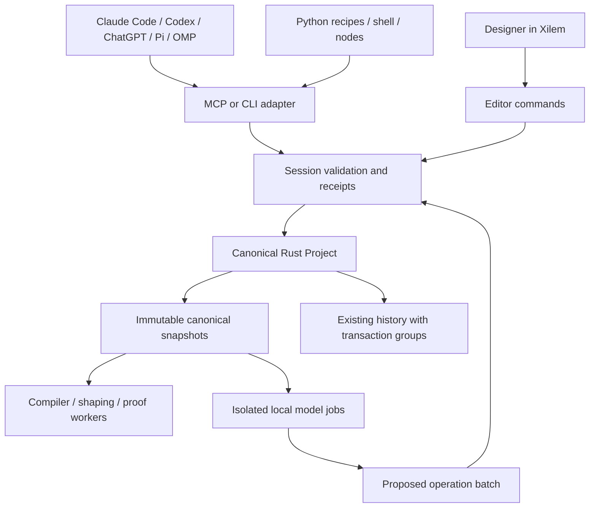

# Agents alongside the live font document

Research date: 2026-09-19 Pacific / 2026-09-20 UTC.
Status: research and proposed design; implementation is not released.

This report recommends a Rust-owned live editing session, with typed operations shared by the editor, external agents, CLI programs, and nodes.
An agent should work on the designer's unsaved font, understand the chosen source and text, produce a reviewable change, and perform an already-authorized edit without asking the designer to repeat that authorization.
MCP provides a useful client adapter; document ownership, transactions, proofs, and recovery remain Runebender responsibilities.

Read the [client matrix and setup paths](agent-client-matrix.md), [implementation gates and acceptance scenarios](agent-interface-plan.md), and [evidence manifest](agent-interface-evidence.json) alongside this report.

## Scope and evidence

The inspected Runebender baseline is `9f55a21f231f6ed18a6137cbcf100adf2527dc25` in this isolated worktree.
The Babelfont migration is still changing the implementation elsewhere.
Nothing here establishes that migration completion, validation, merging, or upstream synchronization has occurred.
Only orchestration task `01a0b6c4-c0a7-7951-917f-7ed2ccda4428` can release implementation with the exact verified final main commit.
Rebase the audit conceptually against that commit before coding; do not implement this report against temporary compatibility boundaries.

This is source and primary-documentation research.
No editor GUI, client conversation, font mutation, model download, runtime benchmark, or competitor test suite was run for this report.
“Implemented” below means present in inspected source, not independently demonstrated in a running release.
“Test evidence” means a test's assertions were inspected, not that this task executed it.
Statements about documentation or plans are labeled separately from implemented behavior and our proposals.

The earlier `/private/tmp/runebender-counterpunch-review-20260919/REVIEW.md` and its `EVIDENCE.json` were reused as the starting feature review.
This report concentrates on live editing and recovery rather than repeating that broader comparison.
Public HEAD queries confirmed the following competitor revisions during this research:

| Project | Inspected revision | Primary evidence |
|---|---|---|
| Counterpunch | `1cc976ae88de2f7b95c823796b39040fede30188` | Live Python hooks, assistant execution/context, binary inspection, Python docs and tests |
| Fontra | `65eb043dbac9e41482ab40034b26757e2541e39d` | Font handler, remote connection, browser font controller, handler tests |
| Pi | `d1230ea2000d876b479a69b8b061f9d670f262f5` | Coding-agent README and model configuration |
| OhMyPi | `10b867cb2eeb7809b883a88dfebe1919ff0c2764` | MCP config, discovery implementation, image forwarding |
| pi-mcp-adapter | `97435aabf74e5fbcf1112e7244f931172b9db624` | Adapter setup, transport and authentication documentation |

These are research pins, not proposed dependencies.
Web documentation was retrieved on the research date and may change independently of installed clients.

## Counterpunch first: what the Python API actually buys

Counterpunch implements an immediate loop between code and the open font.
Its `Font()`, `Glyph()`, `Layer()`, and `Master()` helpers resolve live state; glyph/layer helpers fail outside outline editing instead of silently choosing arbitrary objects.
Its scripts and console support repeatable procedures and immediate experimentation.
That live access and discoverability are the product advantages Runebender needs to match.
[Python workflow](https://github.com/counterpunchspace/editor/blob/1cc976ae88de2f7b95c823796b39040fede30188/documentation/python/01-python-in-counterpunch.md).

The implementation permits Python to mutate wrappers directly, then canonicalizes the font and derives a before/after diff for the shared change bridge.
History attribution distinguishes assistant and Python edits.
The assistant serializes execution and waits for the committed refresh work.
If a script changes the font and then fails, the assistant can return `changesCommitted: true` and `state: partial`.
This is explicit recovery information, not universal transaction rollback.
[Post-execution handling](https://github.com/counterpunchspace/editor/blob/1cc976ae88de2f7b95c823796b39040fede30188/webapp/js/python-post-execution.ts), [assistant execution](https://github.com/counterpunchspace/editor/blob/1cc976ae88de2f7b95c823796b39040fede30188/webapp/js/ai-assistant.ts#L3036).

Test code checks canonical snapshot diffs, scoped changes, transaction closure on failure, prompt attribution, and mixed edits grouped into logical history.
These assertions support a serious editing integration, but do not establish that all exceptional mutations roll back or that every browser/runtime case passes.
[Python integration tests](https://github.com/counterpunchspace/editor/blob/1cc976ae88de2f7b95c823796b39040fede30188/webapp/tests/python-post-execution.test.js).

Counterpunch also exposes active text, feature preferences, variation location, glyph tokens, cursor context and shaped data.
Its analysis compiler supplies a stable font hash; later binary inspection names that hash explicitly.
Borrow that explicit relationship between the document being discussed and the font being measured.
Do not reduce the comparison to the number of Python methods.
[Context and binary analysis](https://github.com/counterpunchspace/editor/blob/1cc976ae88de2f7b95c823796b39040fede30188/webapp/js/ai-assistant.ts#L3352), [tool descriptions](https://github.com/counterpunchspace/editor/blob/1cc976ae88de2f7b95c823796b39040fede30188/webapp/js/assistant-config.ts).

Python contributes concise iteration, reusable recipes, a familiar font ecosystem, numerical analysis, and access to specialist libraries.
Counterpunch's package documentation limits its browser runtime to pure Python or Pyodide-compatible wheels, and documents lazy loading of NumPy, Matplotlib and pandas.
It also describes additional plugin types as forthcoming; do not present those plans as shipped extension coverage.
[Package support](https://github.com/counterpunchspace/editor/blob/1cc976ae88de2f7b95c823796b39040fede30188/documentation/python/07-installing-plugins-and-packages.md).

Runebender should support the same useful procedures through external Python when needed.
A thin Python client can retrieve snapshots, construct exact operation batches, submit them, and inspect receipts without implementing its own editable font model.
FontTools or numerical processing can run on a private export of a named snapshot, returning measurements or a proposed import with provenance.
Neither an external interpreter nor a node graph automatically makes a procedure deterministic; input versions and worker behavior still matter.
Defer an embedded interpreter because the immediate gaps are session correctness and proofing, not because Python is inherently unsuitable.

## Fontra second: subscriptions are useful; rollback arguments are not guarantees

Fontra's Python font handler and JavaScript controller communicate through a WebSocket remote-object protocol.
The handler supports pattern-based subscriptions, separates incremental edits from final edits, and routes final changes into backend writing.
That distinction is useful for responsive editing: transient gesture updates need not become thousands of durable operations.
[Font handler](https://github.com/fontra/fontra/blob/65eb043dbac9e41482ab40034b26757e2541e39d/src/fontra/core/fonthandler.py#L361), [remote connection](https://github.com/fontra/fontra/blob/65eb043dbac9e41482ab40034b26757e2541e39d/src/fontra/core/remote.py).

The same handler's `editFinal` contains TODOs for history recording and locking/checking despite accepting rollback data.
The browser controller owns per-glyph undo stacks and invalidates affected stacks on external changes.
These are implemented boundaries, not evidence of server-owned atomic multi-agent transactions.
Runebender should borrow selective subscription and invalidation ideas while defining its own unsaved-document and undo contract.
[Controller history](https://github.com/fontra/fontra/blob/65eb043dbac9e41482ab40034b26757e2541e39d/src-js/fontra-core/src/font-controller.js#L825).

Handler tests exercise glyph edits and layer deletion through final changes.
They are useful examples of observable backend behavior, not a test of Runebender's desired no-save agent workflow.
[Handler tests](https://github.com/fontra/fontra/blob/65eb043dbac9e41482ab40034b26757e2541e39d/test-py/test_fonthandler.py#L122).

## Other relevant integrations

Figma documents agents writing native editable objects through `use_figma`, with an explicit file or selection link and client-side conversation.
The lesson is to give the agent the application's real structure and an explicit target.
Its documented Plugin API execution model does not establish transaction semantics suitable for a font editor.
[Figma write to canvas](https://developers.figma.com/docs/figma-mcp-server/write-to-canvas/).

ComfyUI documents queue, history, interruption and WebSocket progress routes.
Those capabilities inform Runebender's isolated local-job service; a graph canvas without a job lifecycle would leave designers unable to distinguish running, failed and abandoned work.
This is an architectural comparison, not a recommendation to depend on a ComfyUI server.
[ComfyUI routes](https://docs.comfy.org/development/comfyui-server/comms_routes).

## Alternatives and decision

| Approach | Benefit | Cost or failure mode | Decision |
|---|---|---|---|
| File editing plus reload | Simple batch automation and Git review | Misses unsaved state; races saves; lacks editor history and selection | Retain as explicitly offline mode |
| Embedded Python with live wrappers | Flexible procedures and immediate exploration | Runtime/package lifecycle, wrapper coverage, mutation recovery and native/WASM divergence | Defer; reassess only for demonstrated workflows |
| MCP tools implemented independently | Fast client integration | Can duplicate geometry and leave undo/retry semantics inconsistent | Use MCP only over shared operations |
| Typed Rust session with CLI/MCP adapters | One authority; exact targets and receipts; supports agents and scripts | Requires explicit schema, transaction, identity and lifecycle work | Recommended |
| Generic JSON patch over internal Babelfont data | Broad low-level reach | Exposes representation; bypasses preservation and invariant checks | Do not expose as public mutation contract |
| New service owning a second font model | Can run independently | Divergence from the live editor and duplicate persistence | Reject |
| Full collaborative CRDT | Concurrent remote editing | Substantial semantic and history complexity without a demonstrated need | Defer; serialize commits and detect conflicts |

The first version should extend existing modules, not introduce a large replacement framework.
Keep `Project`, canonical drafts/snapshots, and existing editing operations authoritative.
Client wrappers must never implement spacing, outline repair, interpolation, compatibility, or source preservation themselves.
They may compose operations and calculate parameters, with the Rust boundary validating the final batch.

## Current implementation and gaps

All file references in this section refer to the pinned Runebender baseline.
Recheck every row after the migration release.

| Area | Present in source | Gap or limitation |
|---|---|---|
| Canonical font | `Project`, `DocumentSnapshot`, stable `SourceId`, `LayerId`, glyph/point identities, layer drafts and `DocumentChange` | Wire reads still project UFO values and identify points by revision-scoped indices |
| Live transport | Private Unix socket; UI-thread mailbox; no disk fallback | Path-based discovery, no explicit epoch/receipt ledger, synchronous calls, no Windows/browser endpoint |
| Tool surface | Reads, proof, proposal, inventory, experiments, kerning; stdio MCP | No complete view/selection/text context; incomplete layer targeting and schema consistency |
| Source targeting | `live.rs` resolves stable source IDs and rejects ambiguous families | Some schemas inherited from disk tools still advertise `master`; documentation and callbacks remain inconsistent |
| Proposal safety | Batch validation on drafts; revisions; guarded install | Install reports per-glyph outcomes; not a universal atomic batch, no request deduplication |
| Experiments | Canonical isolated source versions; preflight root conflicts; guarded apply/undo | Source-scoped rather than complete variable-family branches; separate apply history; full rollback under internal publication failure not established |
| Proofs | SVG and data-only Designbot scenes; CLI sends raster images | Latin-only, source-specific specimen differs from complete variable compile path; no immutable proof bundle identity |
| Variable preview | In-memory complete compiler; same bytes for shaping/outlines/export; background native preview | Agent proof does not reuse this path; compilation/snapshot lifecycle must become addressable |
| Nodes | Live source, versions, proofs, guarded apply; disk jobs separate | Live-to-isolated-worker adapter, cancellation, durable provenance and restart recovery remain gaps |
| Permission | Mutation tools require `authorization=user-approved` | Caller assertion is not a credential or scoped grant; no enforcement against malicious same-user callers |
| Recovery | Glyph and experiment undo; socket deadline checks | No general receipt query, idempotency, cancel state, unified batch redo or reconnect recovery |
| Client support | `.mcp.json`, `.codex/config.toml`, CLI | Actual client/provider proof delivery is not established for all clients; setup files are not conformance evidence |

Sources: [live tools](../src/document/live.rs), [socket](../src/document/live_socket.rs), [CLI/MCP](../src/application/cli.rs), [draft operations](../src/document/edit_batch.rs), [experiments](../src/document/experiments.rs), [nodes](../src/document/nodes_live.rs), [compiler](../src/document/compile.rs), [Designbot](../src/formats/designbot.rs), [browser limits](../web/README.md).

Specific source findings to verify first:

During this review, orchestration confirmed that findings 1 and 2 were sent to the sole migration implementation owner.
They remain baseline audit findings here, not independently assigned future fixes.
Their status must be checked at the released final main hash.

1. `application/platform/live.rs` checks `result["master"]` against the active source index before refreshing installed glyphs.
   Ordinary live results supply `source_id` plus a source path, while experiment apply supplies a numeric `source`.
   The condition therefore cannot recognize those current result shapes as intended.
   This is source evidence of a refresh/history integration mismatch; no claim about an observed GUI failure is made here.
2. `live.rs` builds a branch specimen from the experiment font but obtains the returned `kerning_revision` from root metadata.
   The proof can therefore describe the wrong kerning state after a branch edit.
3. MCP initialization copies the requested protocol version into its response, ignores all notifications, and blocks reading stdin during a tool call.
   There is no implemented cancellation path merely because a client supports MCP cancellation.
4. MCP server instructions still say to choose a master and that only the designer installs, although live tools accept stable sources and explicit authorized installation.
   `docs/ai-type-design.md` also retains earlier master-oriented examples and prior architectural wording.
5. Experiment application validates expected conflicts before mutation, then performs fallible per-layer restores/history writes followed by metadata publication.
   This supports atomic conflict rejection, but does not prove rollback if a later internal step fails.
   Inject failures before promising all-or-nothing publication.
6. Several live read paths construct a full source projection before returning a small answer.
   Measure projection cost on a real copied family; move hot reads to canonical views when the released migration API permits it.

The [Python spacing example](../examples/propose_spacing.py) explicitly invokes `--font` disk calls.
It is an example of thin orchestration, not a live SDK.
Existing tests in `live.rs`, `experiments.rs`, and `live_socket.rs` cover unsaved reads, proposals, conflicts, undo and expired queue entries.
Their existence does not cover client disconnect-after-commit, GUI refresh, image consumption, multi-master atomic editing, or failure injection during publication.

## Proposed session contract

Everything from this section onward is a proposal, not an existing API.
Names illustrate responsibilities and may change after the migration audit.



### Ownership and execution

The application's document thread owns the writable `Project`.
It captures immutable snapshots and executes short validated commits; socket threads, model processes and renderers never hold writable document references.
Stage expensive validation and compilation on immutable data, then recheck preconditions on the document thread immediately before publication.
Do not hold the editor thread across network calls, Python execution, model inference or a full proof render.
An in-progress pointer gesture is a real document boundary: report it as busy or offer the last committed snapshot with an explicit label; never silently include half a gesture.

A session wrapper should contain protocol metadata, client bindings, permissions, bounded receipts, event cursors and job references around the existing project.
It must not contain another independently editable copy of the font.
Experiment snapshots are explicit derived versions with lineage and reuse canonical data types.
They are not a second model with separate editing rules.

### Discovery, identity and context

Discover live endpoints, perform a bounded handshake, and return a document label, session UUID, fresh document epoch, capabilities and connection status.
Separate session identity from a path, filename, process ID, window title and MCP transport session ID.
Closing/reopening a font changes its epoch; an old reference fails closed even if the same socket path or filename is reused.
Never choose the most recent window or silently switch a client's document after close.
For remote access, list only documents shared with that authenticated client rather than exposing every local path.

Use canonical source/layer/point identities inside the document epoch.
Expose a glyph identity and human-readable name together so renames do not retarget queued edits.
Determine which existing identities survive save/reopen; do not promise persistent IDs when the migration only guarantees lifetime stability.
Keep compiler glyph IDs separate from document glyph IDs because compilation can reorder glyphs.
Carry explicit user-space axis locations and the resolved design/normalized locations, with named mappings and bounds.
An interpolated preview location does not imply an editable source or permission to create one.

The context read captures one coherent `context_revision`: document revision, view/tab, editable source and layer, active glyph, stable selected object IDs, current tool, pending gesture state, and component-editing path with accumulated transforms when available.
It also returns raw text, explicit glyph tokens, caret/selection ranges, segmentation units, direction, script/language, features, variation location and current compiled-preview status.
Define byte versus scalar versus UTF-16 offsets explicitly; return UTF-8 byte ranges for protocol text and conversion metadata for clients that need it.
Do not mutate the user's active source or selection merely to satisfy an agent read.
Operations targeting “the selection” first resolve it into explicit IDs and preconditions; a changed UI selection does not redirect a later commit.

### Discovery and schemas

Publish a small discoverable set of intent-level tools backed by a versioned Rust operation registry.
Generate MCP schemas, CLI validation and optional client types from that registry where practical.
Return protocol version, schema digest, server build, supported operation names, limits and feature flags during handshake.
Negotiate supported MCP versions rather than echoing unknown versions.

Start with discovery/context, bounded reads, snapshot/proof, proposal, apply, receipt/status, cancellation and history inspection.
Expose related operations lazily through capability discovery or categorized schemas as client support permits; keep a small baseline available to clients without tool search.
Do not make clients invent operation names or load all outlines to discover what is possible.
Keep explanations and actionable errors in ordinary language alongside machine-readable codes.
Validate unknown fields, sizes, identity types, coordinate finiteness and all target scopes on the server even when client schemas already checked them.

### Edits, authorization and transaction boundaries

A mutation request contains session/epoch, operation ID, explicit targets, read dependencies, expected revisions, a reason, and the applicable authorization scope.
The server resolves all targets, validates the entire bounded batch, stages changes using canonical drafts, then commits changed layers and metadata as one history group.
The initial implementation should support a narrow atomic scope it can actually guarantee; unsupported cross-source or structural transactions must fail before mutation.
Bound both operation count and resulting geometry size, not just request bytes.

Reads used to decide an edit matter as well as its writes.
For example, a component fit depends on the base outline and anchors; a spacing decision depends on references, kerning/groups, features and location.
Track a conservative dependency set and reject or require renewed evaluation when it changes.
Allow disjoint edits from separate agents when their dependency sets still match.
Do not block every proposal merely because an unrelated glyph changed the document's global revision.

Proposing and applying are distinct operations, but authorization can cover the complete sequence.
“Compare these options” grants proposal work; “increase n by 12 units in Regular” can authorize that bounded root edit without an extra confirmation.
Reuse the authorization for retries and authorized refinements within its declared targets and limits.
Broader targets, destructive structure changes or persistence require scope expansion only when not already authorized.
Keep the client's existing approval policy intact; the editor should not attempt to disable it.

The current `user-approved` string is a cooperative assertion, not proof of consent.
For an untrusted or remote client, enforce editor-issued grants bound to principal, document epoch, operation categories, target sets and lifetime.
Do not claim that a model's own argument authenticates a user decision.
A trusted local-client mode can accept the host's recorded authorization under an explicit pairing policy; unsupported clients use designer-issued scoped grants once, not a prompt for every point.
Read access is also scoped because sending font geometry to a cloud client is a separate concern from changing it.

### Results, partial work and errors

Every mutation yields a receipt with operation ID, terminal state, before/after revisions, affected identities, history group, proof invalidations, and whether disk was touched.
Use states such as `rejected`, `committed`, `cancelled_before_commit`, and `running` for jobs.
Report `partial` only for explicitly non-atomic work such as a sequence of independent batch commits, with a receipt for each committed part and the unattempted remainder.
Never report partial success as an ordinary successful all-or-nothing transaction.
Unexpected internal publication failure needs rollback or an explicit recovery-required state, not an empty error that conceals changed data.

Errors include a code, readable explanation, exact conflicting target, expected/actual revision where allowed, whether any state changed, and a recommended next action.
Examples include `STALE_TARGET`, `DEPENDENCY_CHANGED`, `SOURCE_REMOVED`, `BUSY_GESTURE`, `INCOMPATIBLE_LAYERS`, `COMPILE_FAILED`, `PERMISSION_SCOPE`, `SESSION_CLOSED` and `RESULT_UNKNOWN`.
Validation failure must leave document data, dirty state, histories and revisions unchanged.
Distinguish a valid no-op from a mutation, and avoid creating empty history entries.

The following is an illustrative contract shape, not an implemented tool or frozen schema.
Identity values must come from discovery/reads; the client cannot infer them from the displayed source order.

```json
{
  "operation": "apply_edits",
  "protocol": "runebender.session/1",
  "document_epoch": "epoch-from-connect",
  "operation_id": "client-unique-id",
  "authorization_grant": "grant-from-trusted-host-or-editor",
  "reason": "Apply the requested 12-unit advance increase",
  "atomic": true,
  "edits": [{
    "target": {
      "glyph_id": "glyph-from-read",
      "source_id": "source-from-read",
      "layer_id": "layer-from-read"
    },
    "expected_revision": "revision-from-read",
    "operations": [{"op": "set_width", "width": 612}]
  }],
  "read_dependencies": [{
    "target": "reference-layer-from-read",
    "expected_revision": "reference-revision"
  }]
}
```

```json
{
  "operation_id": "client-unique-id",
  "state": "committed",
  "document_epoch": "epoch-from-connect",
  "before_revision": 41,
  "after_revision": 42,
  "history_group": "history-from-commit",
  "changed_targets": ["target-from-request"],
  "saved": false,
  "receipt_retention": "document-session",
  "proof_status": "pending-for-revision-42"
}
```

The agent reports the change as applied and unsaved, then requests proof for revision 42.
If the response is lost, it queries `operation_id` rather than recomputing 12 units from the newly changed width.
If a dependency changed, rejection names it and explicitly reports `state_changed=false` instead of returning a misleading partial success.

### Retry, timeout, cancellation and crashes

Use a client-generated idempotency key scoped to the document epoch and authenticated principal.
Bind it to a canonical request digest; the same key with a different payload is an error.
Keep a bounded server receipt ledger and advertise its retention/expiry policy.
Repeated accepted requests return the existing receipt without another mutation or undo item.
A task/proposal name alone is not sufficient deduplication for all operation types.

On timeout, query the receipt before retrying.
A timeout or disconnected stream does not prove failure or cancel the operation.
The MCP specification likewise distinguishes disconnection from cancellation, and cancellation can race completion.
[Transport semantics](https://modelcontextprotocol.io/specification/2025-11-25/basic/transports), [cancellation](https://modelcontextprotocol.io/specification/2025-11-25/basic/utilities/cancellation).

Check cancellation and deadlines before the commit boundary.
Once committed, return the committed receipt even if cancellation arrived too late; undo is a separate operation.
Long jobs return a job ID promptly and expose polling as the lowest-common-denominator recovery path.
Map supported MCP progress/cancellation onto that lifecycle without making correctness depend on a client's event support.

In the first milestone, document the ledger as session-memory only.
After an editor crash, return a new epoch and `RESULT_UNKNOWN` for old requests; never replay them blindly into a reopened font.
Durable recovery later requires an atomic journal containing enough canonical change and history data to reconstruct the commit, not merely a saved request ID.
Recovering unsaved work to a private journal must not silently save the user's UFO.

### Undo and redo

Group one authorized atomic batch into one named history action showing actor, reason, sources and glyphs.
Reuse the canonical layer/source histories, with a transaction coordinator that prevents one batch being undone twice through separate UI and agent histories.
The designer's ordinary undo should follow the editor's documented history order.
An agent's targeted undo must name its receipt and verify all affected current values; it must not overwrite a later designer change.
Redo revalidates identities, scopes and expected state rather than restoring an obsolete whole-font snapshot.
Independent later edits survive a targeted reversal; overlapping edits return a conflict with an inspectable path to resolution.

### Proofs grounded in one variable snapshot

Capture one canonical document snapshot and immutable compiled-font handle, carrying the document revision, branch lineage, compiler/configuration digest and font-byte hash.
Reuse `document::compile` and `text::shape` so glyph order, GSUB/GPOS, variable outlines, advances and mark positioning come from the same bytes as export.
Render those compiled outlines at the exact location used for shaping.
Do not combine fresh metrics with an old image, apply UFO kerning a second time, or substitute the root's features/kerning when proofing a branch.

A proof recipe identifies text/tokens, script/language, bidi policy and runs, feature settings, axis location, size, viewport/scale, renderer and comparison baseline.
Return glyph names and compiled IDs, clusters, advances, offsets, missing-glyph diagnostics and actual PNG content or an accessible artifact.
Tie every page and comparison panel to its snapshot and recipe hash.
Show pending, stale and failed compile states explicitly; a stale successful preview may be useful only when labeled with its older revision.

Variable experiment proofing needs a complete family snapshot with the branch's source changes overlaid at the canonical boundary.
It must not construct a second hand-maintained UFO family in a client.
Until that overlay is supported, advertise source-only experiments honestly and reject requests for a variable branch proof.
Retain editable source proofs for control-point inspection, clearly distinct from compiled output proofs.

Actual image receipt is a separate acceptance gate from successful rendering.
A text-only model may inspect shaping and measurements but cannot claim optical review.
Compare at text and display sizes across Latin, Hebrew and Arabic, including marks, ligatures, mixed direction and variable midpoints.
A mechanical triangle-identification test proves image delivery, not competence at spacing or Arabic design.

### Incremental context, jobs and provenance

Give document changes a monotonic event sequence, affected targets, actor/receipt and invalidation classes from `DocumentChange`.
Maintain a bounded replay buffer; a lost cursor returns a clear resync requirement.
Separate ephemeral view/selection events from committed font changes and throttle drag updates.
Support `changes_since` polling before optional subscriptions, with bounded reads and explicit pagination.
Consumers re-read changed targets rather than applying arbitrary undocumented internal patches.

Local model jobs consume immutable snapshots or disposable exports, never the live source directory.
They run outside the editor process with declared executable/model hashes, resource limits, timeout, cancellation and captured output.
Process separation is not an OS sandbox: if a worker has ordinary user filesystem/network rights, say so and use available platform isolation before describing it as constrained.
A worker returns validated proposed operations or an import artifact for review.
It cannot directly install into the root or inherit broad live-session credentials.

Extend existing experiments and live nodes with job IDs and lineage rather than adding a competing experiment dashboard.
Record parent snapshot, requested scope, dependency hashes, exact operation batches, text recipes, model/runtime versions, seed, parameters, relevant prompt or redacted prompt digest, and outputs.
Distinguish replaying deterministic operations from rerunning probabilistic inference; equal seeds do not guarantee equal output on different runtimes/hardware.
Cache only when every input read is represented, including components, features, groups, variation metadata and worker configuration.
Persist reusable recipes independently from temporary session IDs.
Export provenance as a sidecar bundle by choice; do not overwrite source metadata with every chat transcript.

### Native, browser and remote boundaries

Keep Unix IPC as the first local native path, with stdio MCP forwarding into it.
Inspect and bound connection handling, queues and frames so a slow client cannot monopolize the accept loop or editor thread.
Windows needs a separately tested named-pipe or authenticated-loopback adapter; a Unix build does not prove Windows support.

The current browser contains an in-memory Project and has no native socket/process host.
A future browser adapter must route to that same WASM Project through a narrow authenticated bridge, identify the tab/document epoch, and fail closed when the tab closes or reloads.
A server-side copy of its font would defeat the live-unsaved requirement.
Browser refresh recovery and source-file saving remain independent product capabilities.

For generic remote clients, prefer an optional Streamable HTTP gateway with authentication, origin validation, quotas and explicit document sharing.
Keep it out of the core document modules.
MCP's HTTP transport guidance requires origin validation and recommends local-only binding for local servers.
Transport authentication must map to document permissions; an MCP session ID is not an authorization grant.
[MCP transport requirements](https://modelcontextprotocol.io/specification/2025-11-25/basic/transports).

For ChatGPT, evaluate the documented Secure MCP Tunnel before building a public gateway solely for that client.
It can reach a configured local stdio or HTTP MCP server through a running outbound tunnel client.
This still requires account/workspace setup and explicit local document sharing; it does not let a webpage open a Unix socket directly.
Test whether Runebender's per-process document binding survives that host's process lifecycle; explicit document handles are safer than assuming one permanent stdio conversation.
[Secure MCP Tunnel](https://developers.openai.com/api/docs/guides/secure-mcp-tunnels).

### Observability and product presentation

The designer should see which client is connected, what it may change, its current target/version, running jobs, and recent applied actions.
Use existing proposal, Nodes and history surfaces with clear labels and a stop/disconnect control.
Keep provider login and conversation in the chosen client.
No inspected workflow requires embedding provider authentication to achieve live editing.

Structured logs correlate client request, operation, document epoch, queue time, validation, commit, compile and render durations.
Record connection failures and output limits without dumping entire font payloads or credentials by default.
An exportable diagnostic bundle contains build IDs, sanitized receipts, recipes and reproducible fixture references.
Measure latency and token use rather than claiming that a new protocol is inherently faster.

The first useful result is not universal scripting parity.
It is a designer and an external agent making one correct, visible, reversible change to the same unsaved font, with no ambiguity about the target, revision, proof or saved state.
