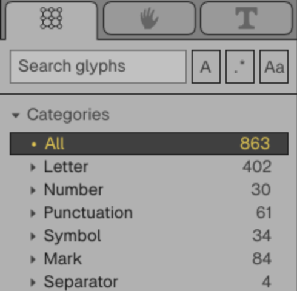
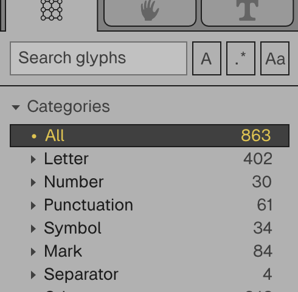

# Browser rendering and interaction — 2026-09-14

The original browser host drew a 1280×774 backing image for a 1280×774 CSS
canvas even on a 2× display. The browser enlarged that image to 2560×1548
physical pixels. Text, lines, and point markers were visibly blurred.

The corrected host supplies the same device scale to Masonry, scene replay, and
pointer conversion, and allocates all physical display pixels. Vello CPU now
builds with WebAssembly SIMD. Repaints follow toolkit requests and pointer motion
is coalesced into animation frames. This is the existing Rust editor and font
model running locally in the browser.

## Sharpness proof

These matching 2× browser crops are direct screenshots at their original pixel
size. View the files at 100% rather than scaling them to fit a window.

Before: 

After: 

## Interaction and layout evidence

The full-window captures use a 1280×800 CSS viewport. The 2× files are 2560×1600
physical pixels. The editor screenshots show a deliberately moved outline point;
the Nodes capture follows a real node drag. Nothing is a static mock interface.

- [Gray outline editor, 2×](editor-gray-2x.png)
- [Light outline editor, 2×](editor-light-2x.png)
- [Resized left panel, 2×](resized-editor-2x.png)
- [Editable example graph, 2×](nodes-2x.png)
- [Xilem overview, 1×](xilem-overview-1x.png)
- [Historical GPUI browser editor reference, 1×](gpui-editor-reference-1x.png)

The GPUI capture is an appearance reference at the same CSS viewport; its bundled
font revision and fit are not asserted to match the current Xilem source exactly.
The current browser uses committed desktop UI code. Uncommitted desktop parity
work in the other task is excluded from the release snapshot.

## Reproduce

Build and serve `web/` as described in `web/README.md`, then run
`node web/quality.cjs` with `RUNEBENDER_PROOFS` set to an output directory.
The matrix covers 1×, 2×, and fractional 1.25×, 1000–1440px windows, and a live
change to 1.5×. It checks actual font edits, undo/redo, painted zoom and panel
movement, Gray/Light/Dark, focus release, paste/composition DOM events, and node
movement with retained connections. It rejects an idle repaint loop.

`metrics.json` contains local Chrome render timings from this sequence. They
include rendering and canvas upload, not end-to-end input latency. The last 120
rendered frames are retained, with the first two entries dropped for the report.
These measurements are not performance guarantees for other machines or browsers.

Browser-only WASM Clippy and formatting pass. Safari/Firefox, actual OS IME
candidate windows, accessibility tree forwarding, persistent saving, own-file
loading, and workflow execution are not certified here. Native dividers still
have a narrow hit edge and can retain the default cursor before dragging; the check proves real resizing at that edge. Homepage
screenshots and rotation have not changed.
