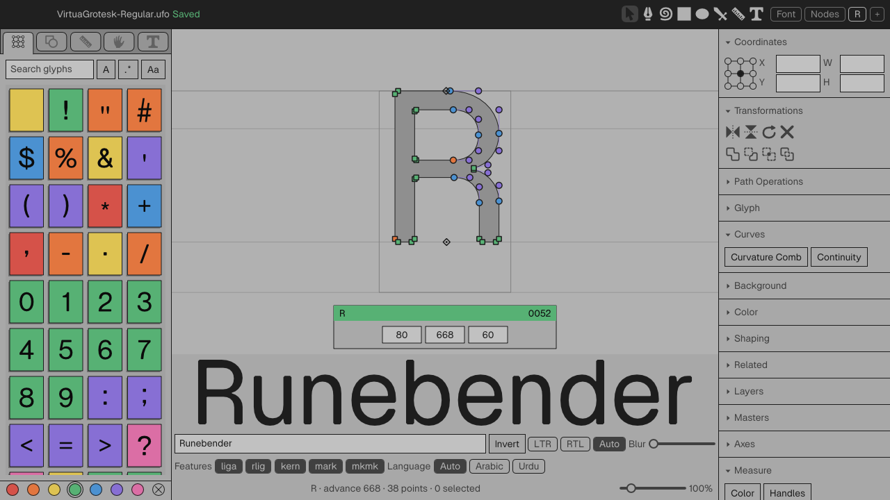

# Xilem / GPUI editor visual comparison

Date: 2026-09-11

This is a screenshot-first comparison of the Xilem editor against the GPUI
reference at the same 1280 x 720 viewport, using glyph `R` and the gray theme.
The Xilem capture uses the real Virtua Grotesk designspace. The GPUI capture
uses its embedded read-only demo font, so this audit compares application
layout and hierarchy rather than exact outline geometry.

The current-run GPUI reference was inspected in the in-app browser. Browser
security prevented exporting that capture to this directory, so the findings
below record only directly observed differences and avoid pixel-diff claims.

## Outcome

Xilem now reads unmistakably as the same Runebender product: the dock widths,
dark title strip, gray surface stack, thin keylines, glyph-mark colors, and
point/handle vocabulary are close. It is not yet visually matched, chiefly
because the center workspace and the right inspector assign emphasis
differently.

The next phase should begin with macro geometry. Matching the canvas/proof
split and glyph fit will produce a larger improvement than further palette or
point-token tuning.

## Priorities

### P0: restore the editor canvas as the dominant region

In the GPUI reference, the canvas occupies roughly 510 pixels vertically and
the proof strip roughly 145 pixels. In the Xilem capture, the visually distinct
proof-and-controls region occupies roughly 275 pixels, leaving a shallower
editing canvas. The `R` is consequently about one third smaller and sits high
in the available space, while the proof text becomes the strongest object in
the window.

Match the effective pane split, then match glyph fit and centering. Xilem
already declares a 140-pixel proof drawing height, so the first implementation
task is to trace the composed flex/layout result rather than merely changing
that constant.

### P1: match effective glyph-rail density

Both editors use a five-column rail, and Xilem already declares 44-pixel rail
cells. The rendered packing still differs: the GPUI reference exposes about
eleven compact rows in the same height, while Xilem exposes about seven. This
makes the left rail feel heavier and reduces navigation density.

Compare the full vertical pitch: cell height, grid gaps, rail padding, and any
scroll viewport inset. Do not treat the cell-size constant alone as the cause.

### P1: restore the metrics card's semantic clarity

The floating card's width, border, and shadow are already close. GPUI visibly
labels the sidebearing fields `LSB` and `RSB`; Xilem presents three bare numeric
values. Match the labels and row rhythm, then place the card relative to the
new canvas geometry.

### P1: align inspector hierarchy and default disclosure

The GPUI reference opens a fuller Transformations section, including its
named operations and parameter fields, and shows a clear `nothing selected`
state in Coordinates. Xilem's corresponding inspector is much more collapsed
and leaves empty coordinate fields visible. Some equivalent commands exist in
other sections, but the initial hierarchy is materially different.

Match section order, default open/closed state, header density, and grouping
before refining individual icons. The goal is the same scan path, not simply
the same inventory of commands.

### P2: tune type, spacing, and drawing tokens after geometry

Xilem's panel labels and section rows look slightly larger or taller, and the
proof text is oversized relative to the editor. Point and handle rendering is
broadly close; apparent size differences should be revisited only after the
glyph is fit to the same canvas area.

The top menu is intentionally excluded from the defect list: the GPUI web
build renders an in-window menu, while the Xilem headless capture suppresses
the native menu. These are not comparable in this capture setup.

## Accessibility follow-up

- Bare metrics values rely on position for meaning; visible labels should be
  restored, and accessible names should be checked separately.
- Icon-only transformation buttons need tooltip and accessibility-name
  verification.
- Muted text contrast should be measured from the resolved theme values.
- Static screenshots cannot establish keyboard order, focus visibility,
  screen-reader naming, or scroll behavior.

## Audit steps

1. **GPUI reference capture — strong reference.** Captured at 1280 x 720 in
   the current run and inspected at full size. The embedded font makes outline
   shape non-comparable, but the shell and layout are usable references.
2. **Xilem matched-state capture — usable, hierarchy diverges.** Captured at
   1280 x 720 with Virtua Grotesk, glyph `R`, and the gray theme. The result is
   deterministic and locally saved.
3. **Side-by-side comparison — priorities are clear.** Product identity and
   styling are close; center-pane allocation, rail density, card labeling, and
   inspector disclosure prevent visual parity.

## Recommended implementation order

1. Match center canvas/proof allocation and glyph fit.
2. Match effective glyph-rail vertical pitch.
3. Match metrics-card labels and placement.
4. Match inspector grouping and default disclosure.
5. Recapture gray and dark themes at 1280 x 720 before token-level polish.
